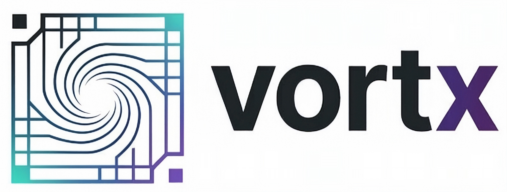

<p align="center">
    <a href="https://vortx.rs"></a>
  <br/>
  <a href="https://discord.gg/vt9DJSW">
      
  </a>
  <a href="https://github.com/dimforge/vortx/actions">
      
  </a>
  <a href="https://crates.io/crates/vortx">
       
  </a>
</p>

# vortx − cross-platform GPU tensor library in Rust

**vortx** is a cross-platform tensor library exposing
linear-algebra operations as GPU compute shaders written in Rust with [rust-gpu](https://github.com/Rust-GPU/rust-gpu).

> **Warning**
> **vortx** is still very incomplete and under heavy development.

## Features

- **GPU tensors** up to rank 4 with views, strides, transpose, reshape, broadcast, squeeze/unsqueeze
- **GEMM** (matrix multiplication) — naive and optimized tiled kernels
- **Element-wise ops** — add, sub, mul, div, copy (in-place)
- **Reductions** — sum, product, min, max, squared norm
- **Multiple backends** via [khal](https://github.com/dimforge/khal): WebGPU (default), CUDA. CPU, CPU-parallel, are
  also supported for debugging.

## Development setup

### cargo-gpu (required for SPIR-V / WebGPU)

The crates.io version of `cargo-gpu` is outdated. Install from Git and let it set up its Rust
toolchain:

```bash
cargo install --git https://github.com/Rust-GPU/cargo-gpu cargo-gpu
cargo gpu install
```

### cargo-cuda (required for CUDA / PTX)

`cargo-cuda` lives in this repository (`crates/cargo-cuda`). Install it from the workspace and
build the `rustc_codegen_nvvm` codegen backend:

```bash
cargo install --path https://github.com/dimforge/khal cargo-cuda
cargo cuda install
```

This requires the **CUDA toolkit** to be installed and the `CUDA_PATH` environment variable to
point to it (e.g. `/usr/local/cuda`). The install step downloads a pinned Rust nightly, adds the
`nvptx64-nvidia-cuda` target, and compiles the codegen backend.
